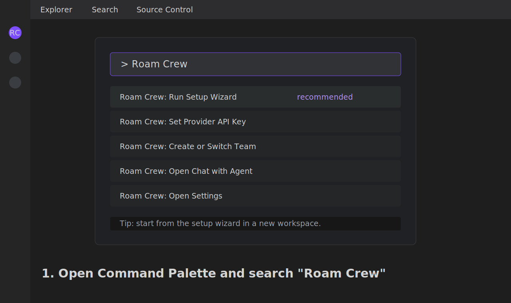
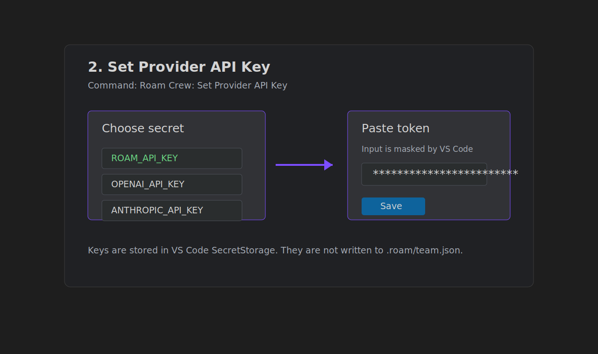
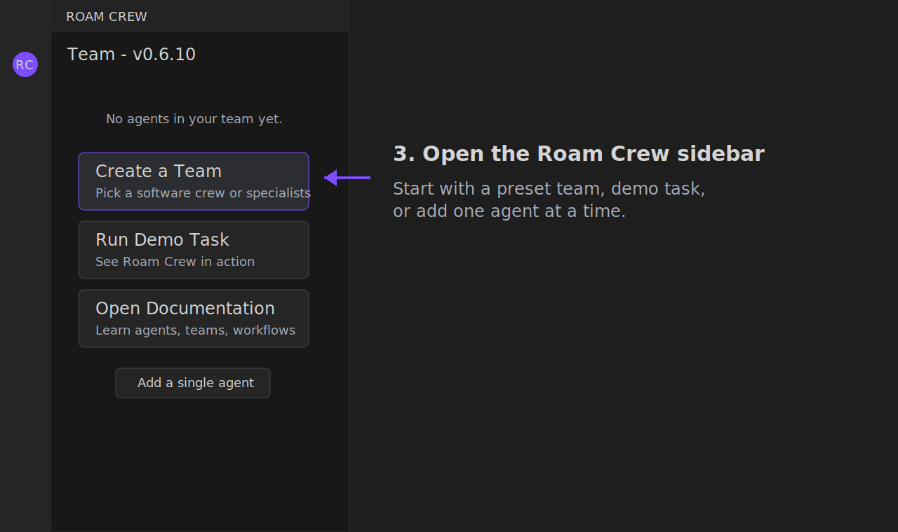
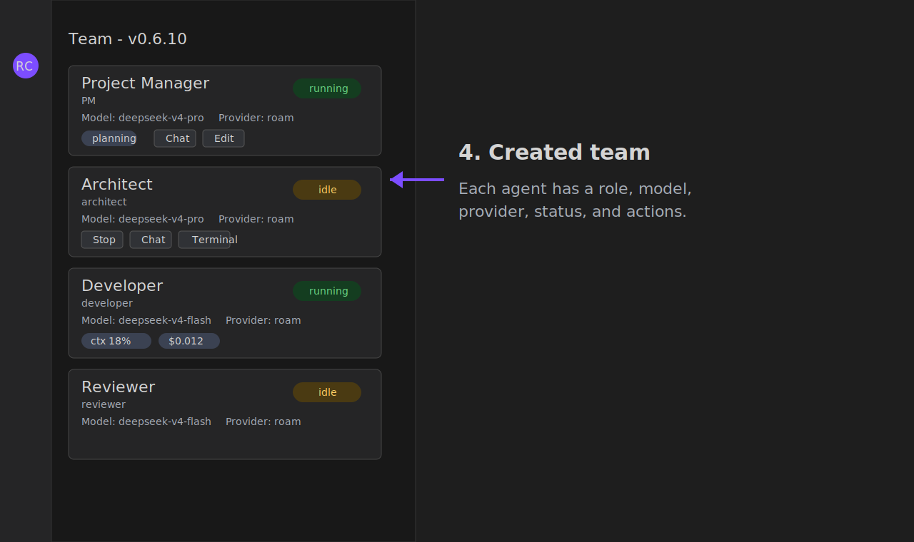
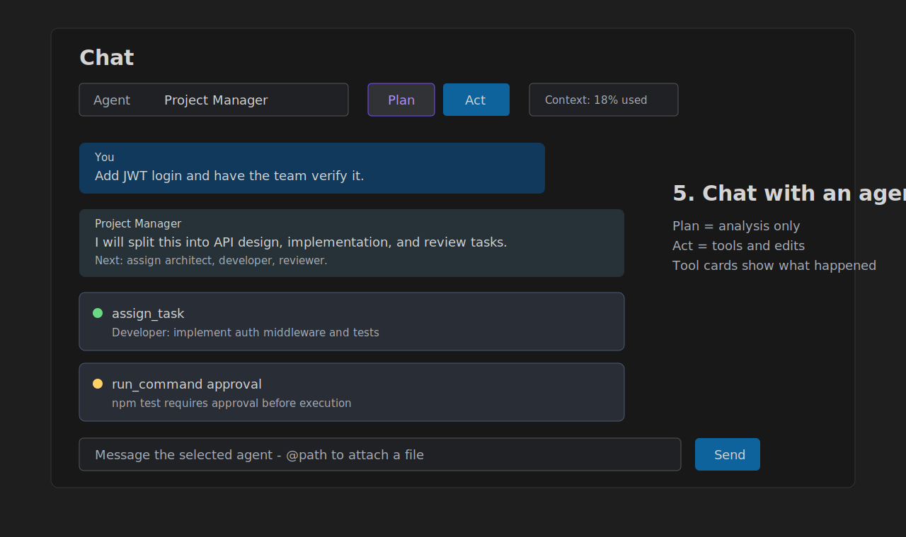
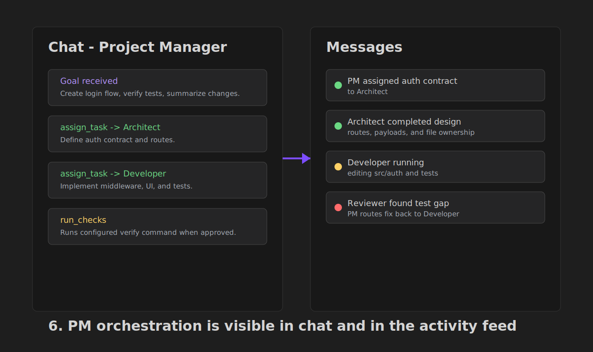
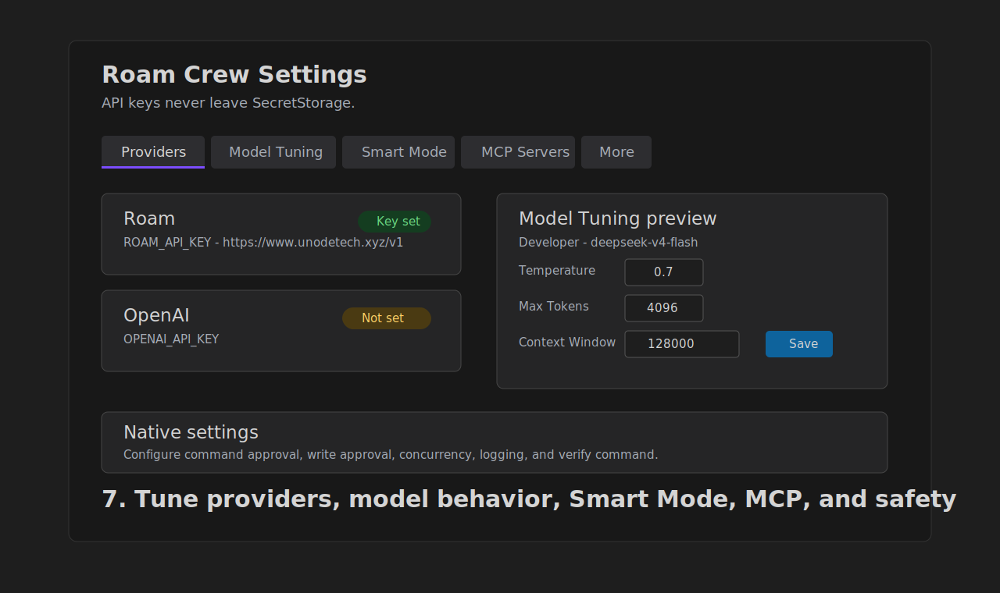
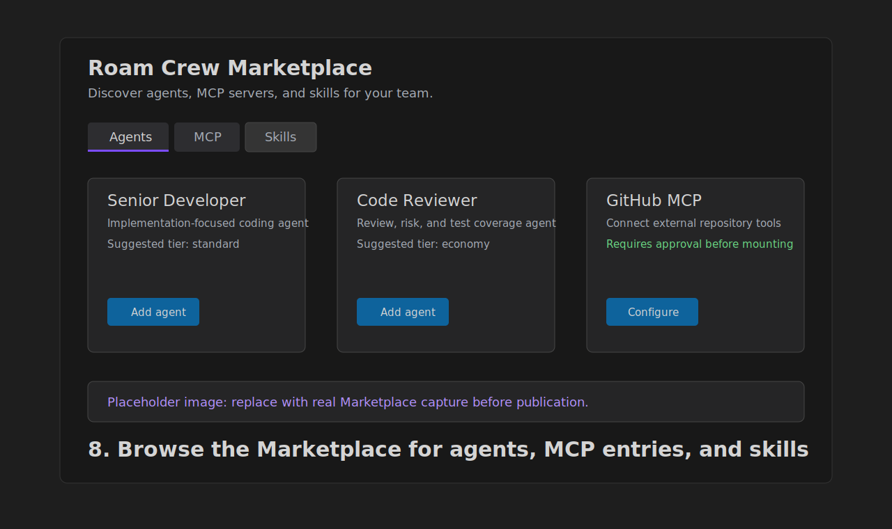
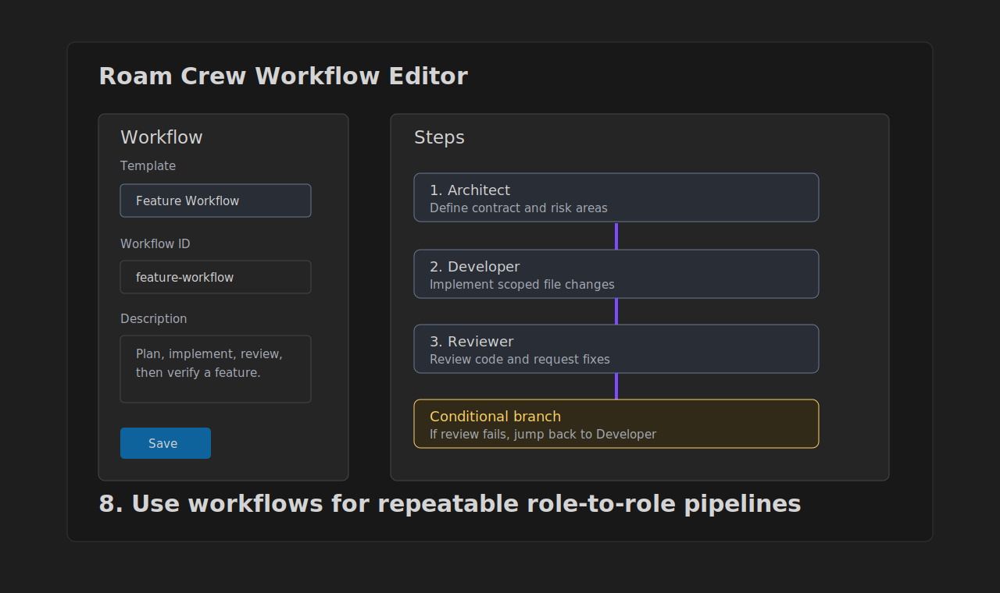

# UnodeAi Graphical User Guide

This guide walks through the main UnodeAi user flow in VS Code: set up a key, create a team, chat with an agent, watch work progress, tune settings, and run workflows.

The images in this draft are lightweight SVG placeholders based on the current UnodeAi VS Code panels and command names. They are scaffolding for the manual/wiki, not real product captures.

**Publish gate:** do not ship this guide to the Marketplace with the placeholder images. Replace every placeholder under `docs/screenshots/` with real VS Code captures from the release build before publishing user-facing documentation.

## 1. Find UnodeAi Commands

Open the VS Code Command Palette with `Ctrl+Shift+P` on Windows/Linux or `Cmd+Shift+P` on macOS, then search for `UnodeAi`.

Common starting commands:

- `UnodeAi: Run Setup Wizard`
- `UnodeAi: Set Provider API Key`
- `UnodeAi: Create or Switch Team`
- `UnodeAi: Open Chat with Agent`
- `UnodeAi: Open Settings`

## 2. Set Your Provider API Key

Run `UnodeAi: Set Provider API Key`, choose the provider secret, and paste the token. Keys are stored in VS Code SecretStorage, not in project files.

For the default Roam gateway, choose `ROAM_API_KEY`.

## 3. Open the UnodeAi Sidebar

Use the UnodeAi icon in the Activity Bar. If this is a fresh workspace, the Team panel starts empty and offers the fastest setup actions.

Click `Create a Team` to use a team preset, or `Add a single agent` if you want to build the roster manually.

## 4. Create or Switch Teams

The default software crew gives you a Project Manager, Architect, Developer, and Reviewer. Each agent can use its own provider/model, role, skills, and tuning.

After the team is created, each agent appears as a card with status, model, provider, skills, and quick actions.

Useful card actions:

- `Start` / `Stop` / `Restart` control an agent session.
- `Chat` opens the selected agent in the Chat panel.
- `Edit` changes the agent configuration.
- `Terminal` opens the agent terminal.
- `UnodeAi: Show Agent Output` opens the agent output channel.

## 5. Chat With an Agent

Open `UnodeAi: Open Chat with Agent` or click `Chat` on an agent card. Pick an agent from the selector, then choose `Plan` or `Act`.

Use `Plan` when you want analysis only. Use `Act` when the agent can use tools, edit files, or run approved actions.

The Chat panel shows:

- The selected agent.
- Plan/Act mode.
- Context usage.
- Live replies.
- Tool cards for reads, edits, commands, MCP calls, and diffs.
- Approval cards when a command or write needs confirmation.

## 6. Let the PM Orchestrate Larger Work

For multi-step work, chat with the Project Manager and describe the goal. The PM can break the goal into tasks, assign teammates, collect results, and run verification when configured.

Watch the `Messages` panel for the cross-agent activity stream. Use it to see who assigned what, which agent replied, and whether the crew is waiting on a user decision.

## 7. Tune Models, Smart Mode, MCP, and Safety

Open `UnodeAi: Open Settings` for provider status, per-agent model tuning, Smart Mode, MCP servers, and links into native VS Code settings.

Important settings:

- `Providers`: verify which API keys are set.
- `Model Tuning`: set temperature, max tokens, reasoning effort, response format, and context window per agent.
- `Smart Mode`: let UnodeAi select economy, standard, or premium models per task.
- `MCP Servers`: see which servers are mounted and which agents can access them.
- Native settings: configure command approval, write approval, concurrency, logging, and verification commands.

Experimental features such as worktree mode may appear in settings before they are ready for the main getting-started flow. Treat those as advanced options until the release notes say otherwise.

## 8. Browse the Marketplace

Open `UnodeAi: Open Marketplace` from the Command Palette or the Team panel toolbar. The Marketplace is where users discover bundled agents, MCP server entries, and skill catalog entries as they become available.

Use the Marketplace when you want to extend a team without hand-editing `.roam/team.json`.

## 9. Run Preset Workflows

Use `UnodeAi: Run Workflow` for repeatable flows such as feature work, bug fixes, code review, and documentation. Use `UnodeAi: Edit Workflow` to customize a workflow template.

Workflows are useful when you want a predictable role-to-role pipeline instead of dynamic PM orchestration.

## Quick Reference

| Goal | Best entry point |
|---|---|
| First setup | `UnodeAi: Run Setup Wizard` |
| Store a token | `UnodeAi: Set Provider API Key` |
| Create a crew | `UnodeAi: Create or Switch Team` |
| Ask one agent | `UnodeAi: Open Chat with Agent` |
| Assign a one-off task | `UnodeAi: Send Message to Agent` |
| Add agents/tools/skills | `UnodeAi: Open Marketplace` |
| Run a standard process | `UnodeAi: Run Workflow` |
| Tune models/settings | `UnodeAi: Open Settings` |
| Review activity | UnodeAi sidebar `Messages` panel |
